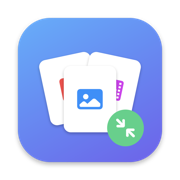
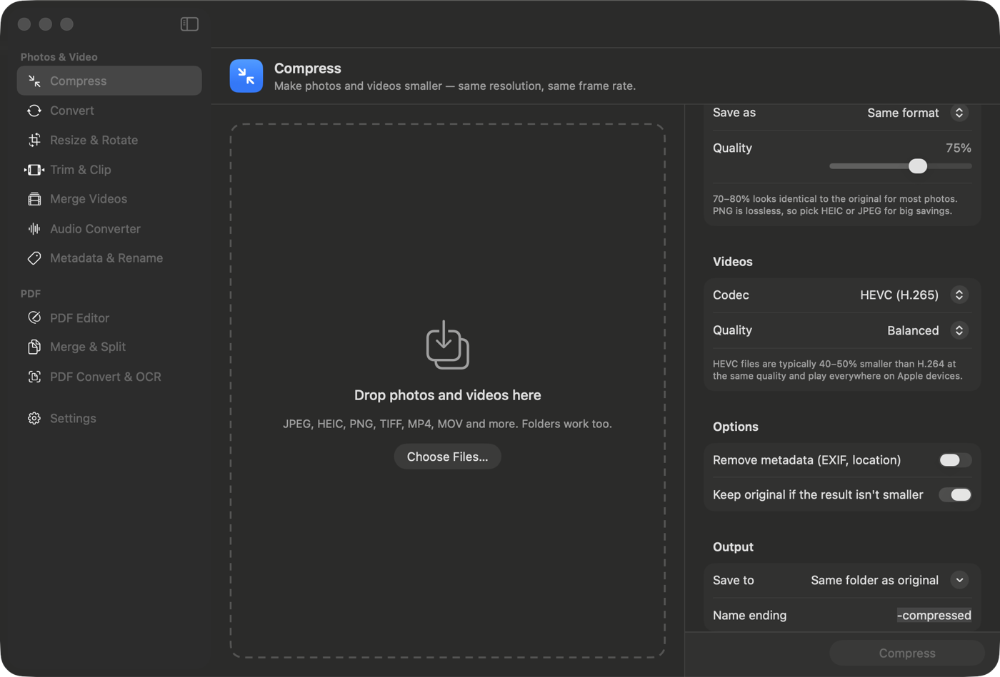
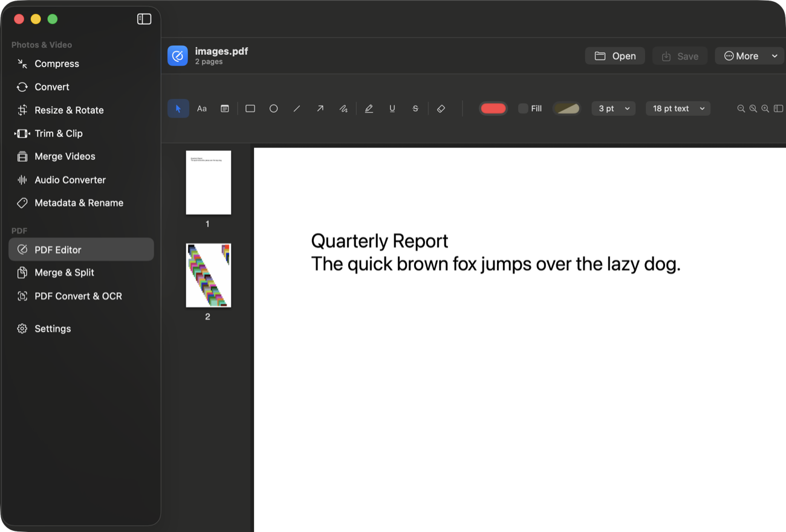
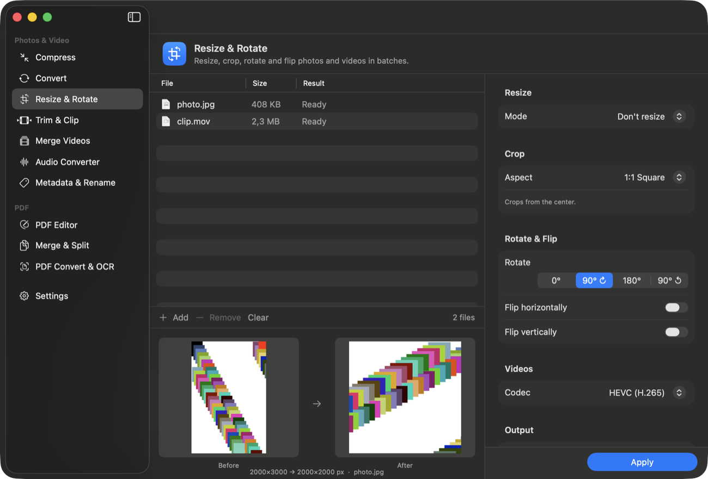

<div align="center">



# File Utilities

**A native macOS app for compressing, converting and editing your photos, videos, audio and PDFs.**

No accounts, no uploads, no subscriptions — everything runs on your Mac.

[**⬇ Download the latest release**](../../releases/latest) · macOS 14 (Sonoma) or newer · Apple silicon



</div>

---

## What it does

### Photos & video

| Tool | What it's for |
|---|---|
| **Compress** | Makes photos and videos take less space while keeping the same resolution, frame rate and quality settings you choose. Keeps the original if the result isn't actually smaller. |
| **Convert** | Photos: JPEG, PNG, HEIC, AVIF, TIFF, GIF, BMP, JPEG 2000, TGA, PSD, OpenEXR. Videos: MP4, MOV, M4V, MKV, WebM, AVI, WMV, FLV, MPEG, TS, OGV, 3GP and animated GIF. When only the container changes, streams are copied with no quality loss. |
| **Resize & Rotate** | Batch resize, crop to an aspect ratio or custom edges, rotate and flip — with a live before/after preview. |
| **Trim & Clip** | Cut a section out of a video (lossless fast mode), extract the audio, make a GIF, or save the current frame as an image. |
| **Merge Videos** | Join clips into one video, in the order you arrange them. |
| **Audio Converter** | MP3, AAC, Apple Lossless, FLAC, WAV, AIFF, CAF, Ogg Vorbis and Opus. Also pulls the audio track out of videos. |
| **Metadata & Rename** | Remove EXIF data and GPS location without re-compressing photos, inspect what a file contains, and batch rename with patterns like `{date}-{n}` (with undo). |

### PDF

| Tool | What it's for |
|---|---|
| **PDF Editor** | Type text anywhere, add sticky notes, rectangles, ellipses, lines, arrows and freehand pen strokes, and highlight, underline or strike through text. Move, recolor, resize, erase and undo. Save in place, save a copy, or export a flattened copy whose markup can't be edited. |
| **Merge & Split** | Combine PDFs and images into one document, drag pages to reorder, rotate, duplicate, delete, extract a selection or split into parts. |
| **PDF Convert & OCR** | Images → PDF, PDF → images at any DPI, and OCR that makes scanned PDFs searchable. Text recognition runs on-device. |

<div align="center">
 
</div>

---

## Install

1. Download `File-Utilities.zip` from the [latest release](../../releases/latest) and unzip it.
2. Drag **File Utilities.app** into your **Applications** folder.
3. The app isn't signed with a paid Apple Developer certificate, so macOS blocks it the first time. Remove the download quarantine flag by pasting this into Terminal:

   ```bash
   xattr -dr com.apple.quarantine "/Applications/File Utilities.app"
   ```

   Then open the app normally. (Alternative without Terminal: double-click the app, then go to **System Settings → Privacy & Security** and click **Open Anyway**.)

**Dependencies: none.** ffmpeg and every library it needs are already inside the app. You don't need Homebrew, Python or Xcode to run it.

---

## Build from source

You only need Apple's **Xcode Command Line Tools**:

```bash
xcode-select --install
```

Then:

```bash
git clone https://github.com/alpbayrak031-hash/File-Utilities.git
cd File-Utilities
./build.sh
```

This produces `File Utilities.app` in the project folder. The script compiles the Swift sources, draws the app icon, copies in ffmpeg with all of its libraries, and ad-hoc signs the bundle.

**ffmpeg while building:** `build.sh` looks for ffmpeg at `Resources/ffmpeg`, then `/opt/homebrew/bin/ffmpeg`, then `/usr/local/bin/ffmpeg`. Install it with `brew install ffmpeg` to get a complete build. Without it, the app still builds and runs — the extra formats (MKV, WebM, AVI, WMV, MP3, Ogg, Opus…) are simply unavailable, and the app says so in Settings. You can also point the app at an ffmpeg binary yourself in **Settings → Choose ffmpeg File…**

To update the bundled ffmpeg later: `brew upgrade ffmpeg && ./build.sh`.

### Project layout

```
Sources/FileUtilities/
  App.swift            App entry point, sidebar, shared app state
  Core/                Processing: images, video, audio, ffmpeg, batch queue, jobs
  PDF/                 PDF editor view, page organiser, conversion and OCR
  UI/                  SwiftUI screens and shared components
Scripts/
  make_icon.swift      Draws the app icon
  bundle_ffmpeg.py     Copies ffmpeg + its libraries into the bundle and rewires them
build.sh               Builds the .app
```

Built with SwiftUI, AVFoundation, Core Image, ImageIO, PDFKit and Vision. No third-party Swift packages.

---

## Notes and limitations

- **Apple silicon only.** `build.sh` builds for arm64; Intel Macs aren't supported.
- **WebP output isn't available.** Homebrew's ffmpeg is built without a WebP encoder, and macOS can't write WebP either. Reading WebP files works.
- **HDR videos** are converted to standard range when you crop, rotate or resize them. Plain compression keeps HDR.
- The app is **ad-hoc signed**, not notarized, hence the quarantine step above.

## Licenses

This project's source code is MIT licensed — see [LICENSE](LICENSE).

The released app bundles **ffmpeg**, which is licensed under the **GPL v3**, along with several supporting libraries. See [THIRD-PARTY-NOTICES.md](THIRD-PARTY-NOTICES.md) for the full list, their licenses and where to get their source code.
